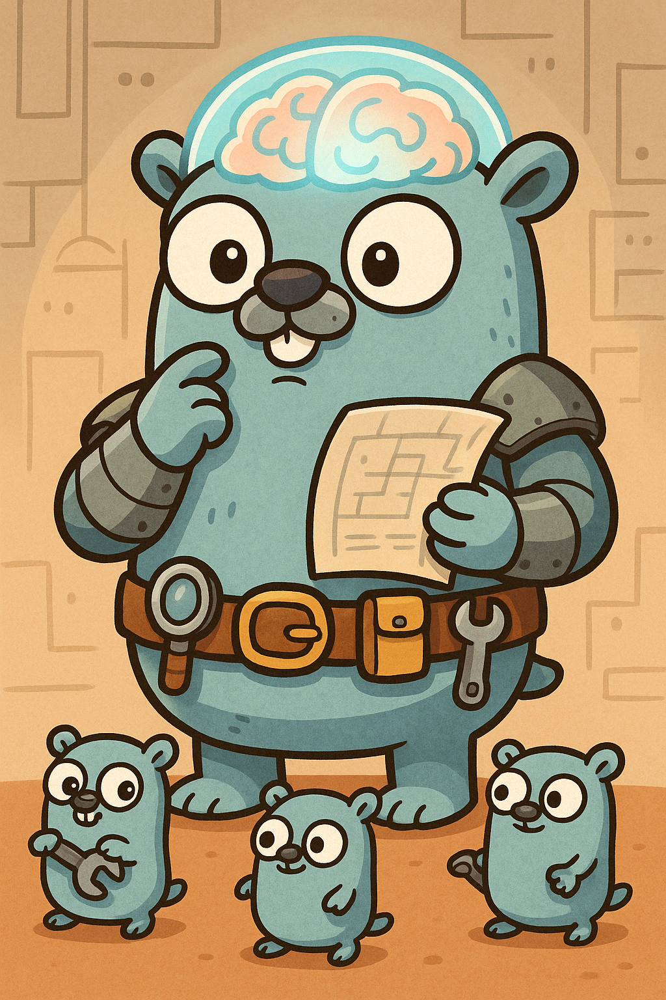

# Interacting with LLMs in Go has never been easier.

This is Gogo the Giant Gopher.

<p align="center">
    
</p>

Gogo can help you using LLM's in Go(lang). Gogo doesn't use any external dependencies and help's speeds up your interaction with LLM's.

## 🚴🏽‍♂️ Roadmap

1. ✅ Build core (1) components to interact with large language models
2. ✅ Create an Agent (2) that can inetract with the outside world using tools
3. Create an Director Agent (3) that uses Agents as tools to manage complex tasks

After this, implement large language models (OpenAI, Claude, ...) and use the fan-in pattern to execute agents in parallel.

### 1. Core

Core enables simple interaction with LLMs. The concept is simple:

`Input -> Model -> Output`

You just have to prepare the messages, add a model and define the output (e.g. json)

```go
// This is not the full example. See 'examples/core/pipe'
pipe := pipe.New(messages, ollamaClient, parser)
result, _ := pipe.Invoke(context.Background())
fmt.Println("Translate from", result.InputLanguage, " to ", result.OutputLanguage)
fmt.Println("Result: ", result.Text)
```

Install using `go get github.com/bit8bytes/gogantic/core/pipe`

### 2. Agents

`Tools -> Agent -> Executor -> Final Result`

Agents can interact with tools and get informationen from the outside world. The following example shows an agent that can access the current temperature.

```go
// This is not a full example. See 'examples/agents/temperature'
tools := map[string]agents.Tool{
    "CurrentTemperatureInFahrenheit": CurrentTemperatureInFahrenheit{},
}

weatherAgent := agents.New(llm, tools)
weatherAgent.Task("What is the temperature outside?")

executor := agents.NewExecutor(weatherAgent)
executor.Run(context.TODO())

finalAnswer, _ := weatherAgent.GetFinalAnswer()
fmt.Println(finalAnswer)
```

Run `go get github.com/bit8bytes/gogantic/agents` to install the agents.

### 3. Director Agents (Coming soon)

Now that Agents (2) can call tools, we are able to create an Director Agent that can call Agents.
